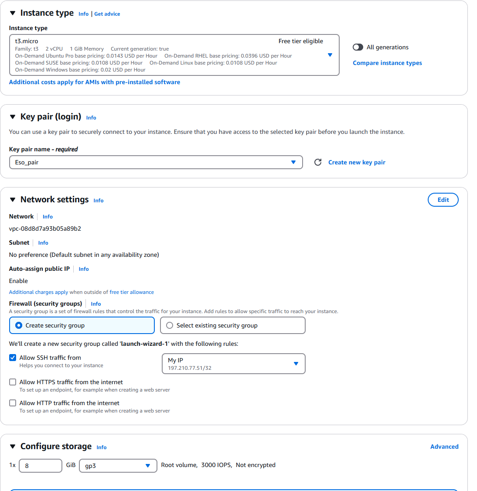

# **AWS EC2 Instance Setup Guide**

This guide will walk you through setting up an **AWS EC2 instance** to run a CLI-based **crypto node** for free using the AWS Free Tier.

## **1. Create an AWS Account**
1. Go to [AWS Free Tier](https://aws.amazon.com/free/) and sign up.
2. Provide your email, password, and billing details.
3. Verify your phone number and choose **Basic Support (Free)**.

## **2. Launch an EC2 Instance**
1. **Go to AWS EC2 Console**: [AWS EC2 Dashboard](https://console.aws.amazon.com/ec2)
2. Click **"Launch Instance"**.
3. **Select an OS**: Choose **Ubuntu 22.04 LTS** (or Amazon Linux 2 for lightweight performance).
4. **Choose Instance Type**: Select **t2.micro (Free Tier Eligible)**.
5. **Configure Security Group**:
   - Allow **SSH (port 22, My IP only)**..
6. **Create Key Pair**:
   - Choose **ED25519** (recommended for better security).
   - Download the `.pem` file (needed for SSH access).
7. Click **Launch Instance** and wait for it to start.

## **3. Connect to Your EC2 Instance**
1. Open a terminal (Linux/macOS) or use **PuTTY** (Windows).
2. Run the following command:
   ```bash
   chmod 400 your-key.pem
   ssh -i your-key.pem ubuntu@your-instance-ip
   ```
   Replace `your-instance-ip` with the **Public IPv4** of your instance 
## **Your setup should look like this**

<div align = "center">




</div>

## **Conclusion**
You have successfully set up an **AWS EC2 instance** and started a **crypto node** using Bitcoin Core. You can use similar steps for Ethereum, Solana, or other blockchain nodes.

Let me know if you need further assistance! 🚀

## 🌐 Connect With Me

[](https://twitter.com/oche_21)
[](https://github.com/eso8484)
[](https://t.me/eso8484)
